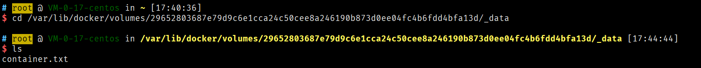

# Docker的常用命令

## 帮助命令

``` shell
docker version  #显示版本信息
docker info     #显示详细信息
docker 命令 --help  #万能帮助命令
```


## 镜像命令

**docker images** 查看所有本地主机上的镜像

```shell
# root @ VM-0-17-centos in ~ [16:50:14] 
$ docker images                         
REPOSITORY    TAG       IMAGE ID       CREATED        SIZE
mysql         latest    0627ec6901db   4 weeks ago    556MB
ubuntu        latest    26b77e58432b   6 weeks ago    72.9MB
hello-world   latest    d1165f221234   2 months ago   13.3kB

#解释
RESPOSITORY 镜像的仓库源
TAG 		镜像的标签
IMAGE ID 	镜像的ID
CREATED 	镜像的创建时间
SIZE 		镜像的大小

#可选项
	-a, --all 		#列出所有镜像
	-q, --quiet		#只显示镜像的id
```

**docker search** 搜索镜像

```shell
# root @ VM-0-17-centos in ~ [16:54:37] 
$ docker search mysql     
NAME                              DESCRIPTION                                     STARS     OFFICIAL   AUTOMATED
mysql                             MySQL is a widely used, open-source relation…   10899     [OK]       
mariadb                           MariaDB Server is a high performing open sou…   4110      [OK]       
mysql/mysql-server                Optimized MySQL Server Docker images. Create…   809                  [OK]

#可选项，通过收藏来过滤
--filter=STARS=3000  	#搜索出的镜像为STARS大于3000的
# root @ VM-0-17-centos in ~ [16:55:30] C:1
$ docker search mysql --filter=STARS=3000
NAME      DESCRIPTION                                     STARS     OFFICIAL   AUTOMATED
mysql     MySQL is a widely used, open-source relation…   10899     [OK]       
mariadb   MariaDB Server is a high performing open sou…   4110      [OK]       
```

**docker pull** 下载镜像

```shell
# root @ VM-0-17-centos in ~ [16:57:10] 
$ docker pull mysql                      
Using default tag: latest	#如果不写tag，默认就是latest
latest: Pulling from library/mysql
69692152171a: Pull complete 	#分层下载，docker image 的核心 联合文件系统
1651b0be3df3: Pull complete 
951da7386bc8: Pull complete 
0f86c95aa242: Pull complete 
37ba2d8bd4fe: Pull complete 
6d278bb05e94: Pull complete 
497efbd93a3e: Pull complete 
f7fddf10c2c2: Pull complete 
16415d159dfb: Pull complete 
0e530ffc6b73: Pull complete 
b0a4a1a77178: Pull complete 
cd90f92aa9ef: Pull complete 
Digest: sha256:d50098d7fcb25b1fcb24e2d3247cae3fc55815d64fec640dc395840f8fa80969
Status: Downloaded newer image for mysql:latest
docker.io/library/mysql:latest	#真实地址

#等价于它
docker pull mysql
docker pull docker.io/library/mysql:latest

#指定版本下载
$ docker pull mysql:5.7
5.7: Pulling from library/mysql
69692152171a: Already exists 
1651b0be3df3: Already exists 
951da7386bc8: Already exists 
0f86c95aa242: Already exists 
37ba2d8bd4fe: Already exists 
6d278bb05e94: Already exists 
497efbd93a3e: Already exists 
a023ae82eef5: Pull complete 
e76c35f20ee7: Pull complete 
e887524d2ef9: Pull complete 
ccb65627e1c3: Pull complete 
Digest: sha256:a682e3c78fc5bd941e9db080b4796c75f69a28a8cad65677c23f7a9f18ba21fa
Status: Downloaded newer image for mysql:5.7
docker.io/library/mysql:5.7
```


 

**docker rmi** 删除镜像

```shell
$ docker rmi -f 0627ec6901db	#删除指定id的容器                                             
$ docker rmi -f 容器id 容器id 容器id	#删除多个容器
$ docker rmi -f $(docker images -aq)	#删除全部的容器
```


## 容器命令

**说明：我们有了镜像才可以创建容器，linux下载一个ubuntu镜像来测试学习**

```shell
docker pull ubuntu
```

**新建容器并启动**

```shell
docker run [可选参数] image

#参数说明
--name="Name"  容器名字 tomcat01 tomcat02 用来区分容器
-d			   后台方式运行
-it			   使用交互方式运行，进入容器查看内容
-p			   指定容器的端口 -p 8080:8080
	-p ip:主机端口:容器端口
	-p 主机端口:容器端口	(常用)
	-p 容器端口
-P			   随机指定端口

#测试，启动并进入容器
$ docker run -it ubuntu /bin/bash                                        
root@a173e0a7b47a:/# 
root@a173e0a7b47a:/# ls  #查看容器内的ubuntu
bin  boot  dev  etc  home  lib  lib32  lib64  libx32  media  mnt  opt  proc  root  run  sbin  srv  sys  tmp  usr  var

#从容器中退回主机
root@a173e0a7b47a:/# exit
exit
```

**列出所有正在运行的容器**

```shell
#docker ps
-a, --all             #列出当前正在运行+历史运行的容器
  -f, --filter filter   Filter output based on conditions provided
      --format string   Pretty-print containers using a Go template
  -n, --last int       #显示最近创建的容器
  -l, --latest          Show the latest created container (includes all states)
      --no-trunc        Don't truncate output
  -q, --quiet           #只显示容器的编号
  -s, --size            Display total file sizes
```

**退出容器**

```shell
exit	#直接停止容器并退出
Crtl + P + Q	#容器不停止退出
```

**删除容器**

```shell
docker rm 容器id	#删除指定容器,不能删除正在运行的容器
docker rm -f $(docker ps -aq)	#删除所有的容器
docker ps -a -q | xargs docker rm -f #删除所有的容器
```

**启动和停止容器的操作**

```shell
docker start 容器id	#启动容器
docker restart 容器id	#重启容器
docker stop 容器id	#停止当前正在运行的容器
docker kill 容器id	#强制停止当前容器
```


## 常用其它命令

**后台启动容器**

```shell
#命令 docker run -d 镜像名
$ docker run -d ubuntu                                                   
c21cd5dd2594ec109dfb7e8eeba6bd129291de1f1095389c9b31492e98360947

#问题docker ps，发现ubuntu停止了

#常见的坑，docker容器使用后台运行，就必须要有一个前台进程，docker发现没有应用了，就会自动停止
#nginx，容器启动后发现自己没有提供服务，就会立刻停止，就是没有程序了
```

**查看日志**

```shell
docker logs -f -t --tail [num] 容器

#没有日志，自己编写shell脚本
$ docker run -d ubuntu /bin/bash -c "while true;do echo hello;sleep 1;done"
#查看进程
$ docker ps                                                                
CONTAINER ID   IMAGE     COMMAND                  CREATED          STATUS          PORTS     NAMES
454ed06e28cb   ubuntu    "/bin/bash -c 'while…"   11 seconds ago   Up 10 seconds             focused_benz
#查看日志
-tf
--tail number #要显示日志条数

$ docker logs -f -t --tail 10 454ed06e28cb            
2021-05-20T09:42:28.697246635Z hello
2021-05-20T09:42:29.698190655Z hello
2021-05-20T09:42:30.699146088Z hello
2021-05-20T09:42:31.700095424Z hello
2021-05-20T09:42:32.700998382Z hello
2021-05-20T09:42:33.702032016Z hello
2021-05-20T09:42:34.702959477Z hello
2021-05-20T09:42:35.703901694Z hello
2021-05-20T09:42:36.704853291Z hello
2021-05-20T09:42:37.705818654Z hello
2021-05-20T09:42:38.706799062Z hello
2021-05-20T09:42:39.707778758Z hello
2021-05-20T09:42:40.708738878Z hello
2021-05-20T09:42:41.709711728Z hello
```

**查看容器中进程信息** top

```shell
#命令 docker top 容器id
$ docker top 8196ca9cbf32            
UID                 PID                 PPID                C                   STIME               TTY                 TIME                CMD
root                31218               31201               0                   17:51               ?                   00:00:00            /bin/bash -c while true;do echo hello;sleep 1;done
root                31295               31218               0                   17:51               ?                   00:00:00            sleep 1
```

**查看镜像的元数据**

```shell
#命令 docker inspect 容器id

$ docker inspect 8196ca9cbf32 
[
    {
        "Id": "8196ca9cbf32705a557c39b3b8dae4373f07cf1f3450619a0287b5ae1f179522",
        "Created": "2021-05-20T09:51:37.707444282Z",
        "Path": "/bin/bash",
        "Args": [
            "-c",
            "while true;do echo hello;sleep 1;done"
        ],
        "State": {
            "Status": "running",
            "Running": true,
            "Paused": false,
            "Restarting": false,
            "OOMKilled": false,
            "Dead": false,
            "Pid": 31218,
            "ExitCode": 0,
            "Error": "",
            "StartedAt": "2021-05-20T09:51:38.059012857Z",
            "FinishedAt": "0001-01-01T00:00:00Z"
        },
        "Image": "sha256:26b77e58432b01665d7e876248c9056fa58bf4a7ab82576a024f5cf3dac146d6",
        "ResolvConfPath": "/var/lib/docker/containers/8196ca9cbf32705a557c39b3b8dae4373f07cf1f3450619a0287b5ae1f179522/resolv.conf",
        "HostnamePath": "/var/lib/docker/containers/8196ca9cbf32705a557c39b3b8dae4373f07cf1f3450619a0287b5ae1f179522/hostname",
        "HostsPath": "/var/lib/docker/containers/8196ca9cbf32705a557c39b3b8dae4373f07cf1f3450619a0287b5ae1f179522/hosts",
        "LogPath": "/var/lib/docker/containers/8196ca9cbf32705a557c39b3b8dae4373f07cf1f3450619a0287b5ae1f179522/8196ca9cbf32705a557c39b3b8dae4373f07cf1f3450619a0287b5ae1f179522-json.log",
        "Name": "/vigilant_wilbur",
        "RestartCount": 0,
        "Driver": "overlay2",
        "Platform": "linux",
        "MountLabel": "",
        "ProcessLabel": "",
        "AppArmorProfile": "",
        "ExecIDs": null,
        "HostConfig": {
            "Binds": null,
            "ContainerIDFile": "",
            "LogConfig": {
                "Type": "json-file",
                "Config": {}
            },
            "NetworkMode": "default",
            "PortBindings": {},
            "RestartPolicy": {
                "Name": "no",
                "MaximumRetryCount": 0
            },
            "AutoRemove": false,
            "VolumeDriver": "",
            "VolumesFrom": null,
            "CapAdd": null,
            "CapDrop": null,
            "Capabilities": null,
            "Dns": [],
            "DnsOptions": [],
            "DnsSearch": [],
            "ExtraHosts": null,
            "GroupAdd": null,
            "IpcMode": "private",
            "Cgroup": "",
            "Links": null,
            "OomScoreAdj": 0,
            "PidMode": "",
            "Privileged": false,
            "PublishAllPorts": false,
            "ReadonlyRootfs": false,
            "SecurityOpt": null,
            "UTSMode": "",
            "UsernsMode": "",
            "ShmSize": 67108864,
            "Runtime": "runc",
            "ConsoleSize": [
                0,
                0
            ],
            "Isolation": "",
            "CpuShares": 0,
            "Memory": 0,
            "NanoCpus": 0,
            "CgroupParent": "",
            "BlkioWeight": 0,
            "BlkioWeightDevice": [],
            "BlkioDeviceReadBps": null,
            "BlkioDeviceWriteBps": null,
            "BlkioDeviceReadIOps": null,
            "BlkioDeviceWriteIOps": null,
            "CpuPeriod": 0,
            "CpuQuota": 0,
            "CpuRealtimePeriod": 0,
            "CpuRealtimeRuntime": 0,
            "CpusetCpus": "",
            "CpusetMems": "",
            "Devices": [],
            "DeviceCgroupRules": null,
            "DeviceRequests": null,
            "KernelMemory": 0,
            "KernelMemoryTCP": 0,
            "MemoryReservation": 0,
            "MemorySwap": 0,
            "MemorySwappiness": null,
            "OomKillDisable": false,
            "PidsLimit": null,
            "Ulimits": null,
            "CpuCount": 0,
            "CpuPercent": 0,
            "IOMaximumIOps": 0,
            "IOMaximumBandwidth": 0,
            "MaskedPaths": [
                "/proc/asound",
                "/proc/acpi",
                "/proc/kcore",
                "/proc/keys",
                "/proc/latency_stats",
                "/proc/timer_list",
                "/proc/timer_stats",
                "/proc/sched_debug",
                "/proc/scsi",
                "/sys/firmware"
            ],
            "ReadonlyPaths": [
                "/proc/bus",
                "/proc/fs",
                "/proc/irq",
                "/proc/sys",
                "/proc/sysrq-trigger"
            ]
        },
        "GraphDriver": {
            "Data": {
                "LowerDir": "/var/lib/docker/overlay2/b22a6747c9d3fb5a282e94726c359d154003b76999b438ee0f4ba801d20fbb34-init/diff:/var/lib/docker/overlay2/8aef4b49c62b0b2cf18a6c3151f903465a6a3fc5d46b9a7d11be860c615039cc/diff:/var/lib/docker/overlay2/dc9dbe45eab2321f7737e6582cee91747d34ef68edc45c2d84a637d9ee0882d7/diff:/var/lib/docker/overlay2/a75cff0ed349d987caab4695bd0edb3e71e70da3754dfee9386e9ba89a3da674/diff",
                "MergedDir": "/var/lib/docker/overlay2/b22a6747c9d3fb5a282e94726c359d154003b76999b438ee0f4ba801d20fbb34/merged",
                "UpperDir": "/var/lib/docker/overlay2/b22a6747c9d3fb5a282e94726c359d154003b76999b438ee0f4ba801d20fbb34/diff",
                "WorkDir": "/var/lib/docker/overlay2/b22a6747c9d3fb5a282e94726c359d154003b76999b438ee0f4ba801d20fbb34/work"
            },
            "Name": "overlay2"
        },
        "Mounts": [],
        "Config": {
            "Hostname": "8196ca9cbf32",
            "Domainname": "",
            "User": "",
            "AttachStdin": false,
            "AttachStdout": false,
            "AttachStderr": false,
            "Tty": false,
            "OpenStdin": false,
            "StdinOnce": false,
            "Env": [
                "PATH=/usr/local/sbin:/usr/local/bin:/usr/sbin:/usr/bin:/sbin:/bin"
            ],
            "Cmd": [
                "/bin/bash",
                "-c",
                "while true;do echo hello;sleep 1;done"
            ],
            "Image": "ubuntu",
            "Volumes": null,
            "WorkingDir": "",
            "Entrypoint": null,
            "OnBuild": null,
            "Labels": {}
        },
        "NetworkSettings": {
            "Bridge": "",
            "SandboxID": "de7ab1ec3092d62d4017bcc77f94f2f9aa86e95f175b037a337c8c3a88747776",
            "HairpinMode": false,
            "LinkLocalIPv6Address": "",
            "LinkLocalIPv6PrefixLen": 0,
            "Ports": {},
            "SandboxKey": "/var/run/docker/netns/de7ab1ec3092",
            "SecondaryIPAddresses": null,
            "SecondaryIPv6Addresses": null,
            "EndpointID": "203d398f0bcdac1f2ced6374053e7b56896418d701644153ecd3171156cc6f9e",
            "Gateway": "172.18.0.1",
            "GlobalIPv6Address": "",
            "GlobalIPv6PrefixLen": 0,
            "IPAddress": "172.18.0.2",
            "IPPrefixLen": 16,
            "IPv6Gateway": "",
            "MacAddress": "02:42:ac:12:00:02",
            "Networks": {
                "bridge": {
                    "IPAMConfig": null,
                    "Links": null,
                    "Aliases": null,
                    "NetworkID": "cea1f96a9599b18ef92650f478f349595b7b5a7a12e49a1b409052d6cbfa3404",
                    "EndpointID": "203d398f0bcdac1f2ced6374053e7b56896418d701644153ecd3171156cc6f9e",
                    "Gateway": "172.18.0.1",
                    "IPAddress": "172.18.0.2",
                    "IPPrefixLen": 16,
                    "IPv6Gateway": "",
                    "GlobalIPv6Address": "",
                    "GlobalIPv6PrefixLen": 0,
                    "MacAddress": "02:42:ac:12:00:02",
                    "DriverOpts": null
                }
            }
        }
    }
]

```

**进入当前正在运行的容器**

```shell
#我们通常容器都是使用后台方式运行的，需要进入容器，修改一些配置

#命令
docker exec -it 容器id bashShell
#测试
$ docker exec -it 8196ca9cbf32 /bin/bash           
root@8196ca9cbf32:/# ls
bin  boot  dev  etc  home  lib  lib32  lib64  libx32  media  mnt  opt  proc  root  run  sbin  srv  sys  tmp  usr  var
root@8196ca9cbf32:/# ps -ef
UID        PID  PPID  C STIME TTY          TIME CMD
root         1     0  0 09:51 ?        00:00:00 /bin/bash -c while true;do echo hello;sleep 1;done
root       363     0  0 09:57 pts/0    00:00:00 /bin/bash
root       400     1  0 09:58 ?        00:00:00 sleep 1
root       401   363  0 09:58 pts/0    00:00:00 ps -ef

#方式二
docker attach 容器id
#测试
$ docker attach 8196ca9cbf32
正在执行当前的代码...

#docker exec	#进入容器后开启一个新的终端，可以在里面操作(常用)
#docker attach	#进入容器中正在执行的终端，不会启动新的进程！
```

**从容器内拷贝文件到主机上**

```shell
docker cp 容器id:容器内路径 目的主机路径
#进入容器中
# root @ VM-0-17-centos in /home [18:06:33] 
$ docker cp 8b84603c410a:/home/test.java /home

# root @ VM-0-17-centos in /home [18:07:05] 
$ ls
alex  arod  hello.java  neos  test.java

#拷贝只是一个手动功能，未来我们使用 -v 卷的技术，可以实现自动同步
```

## 小结


## 作业练习

> **作业一：Docker安装nginx**

```shell
#1.搜索镜像 search
#2.下载镜像 pull
#3.运行测试
# root @ VM-0-17-centos in /home [22:51:35] 
$ docker run -d --name nginx01 -p 3344:80 nginx   #映射端口 --name给容器命名， -p 宿主机端口，容器内部端口           
c102d70ac437b7c94182490c8d8085b1e5bec085bd50f95cdd66df54fc6f9470

# root @ VM-0-17-centos in /home [22:52:26] 
$ docker ps                                    
CONTAINER ID   IMAGE     COMMAND                  CREATED         STATUS         PORTS                  NAMES
c102d70ac437   nginx     "/docker-entrypoint.…"   4 seconds ago   Up 3 seconds   0.0.0.0:3344->80/tcp   nginx01

#4.进入容器查看
$ docker exec -it nginx01 /bin/bash 
root@c102d70ac437:/# whereis nginx
nginx: /usr/sbin/nginx /usr/lib/nginx /etc/nginx /usr/share/nginx
root@c102d70ac437:/# cd /etc/nginx/
root@c102d70ac437:/etc/nginx# ls
conf.d	fastcgi_params	koi-utf  koi-win  mime.types  modules  nginx.conf  scgi_params	uwsgi_params  win-utf
```

思考问题：我们每次改动nginx配置文件，都需要进入容器内部，十分麻烦，要是可以在容器外部提供一个映射路径，达到在容器修改文件名，容器内部就可以自动修改 -v 数据卷


> **作业二：docker安装tomcat**

```shell
#官方的使用
docker run -it --rm tomcat:9.0

#我们之前的启动都是后台，停止了容器之后，容器还是可以查到， docker run -it --rm，一般用来测试，用完就删除

#下载再启动
docker pull tomcat:9.0

#启动运行
docker run -d -p 3355:8080 --name tomcat01 tomcat

#测试访问没有问题
#进入容器
$ docker exec -it tomcat01 /bin/bash 
#发现问题：1.linux命令少了；2.没有webapps，云镜像的原因，默认是最小的镜像，所有不必要的都删除掉
#保证最小可运行的环境
```

思考问题：我们以后要部署项目，都需要进入容器内部，十分麻烦，要是可以在容器外部提供一个映射路径，webapps，我们在外部防止项目，就自动同步到内部就好了！


> **作业三：部署es+kibana**

```shell
#es 暴露的端口很多
#es 十分的耗内存
#es 的数据一般需要放置到安全目录挂载
# --net somenetwork 网络配置

#启动
$ docker run -d --name elasticsearch --net somenetwork -p 9200:9200 -p 9300:9300 -e "discovery.type=single-node" elasticsearch:7.12.1

#增加内存限制，修改配置文件 -e 环境配置修改
$ docker run -d --name elasticsearch --net somenetwork -p 9200:9200 -p 9300:9300 -e "discovery.type=single-node" -e ES_JAVA_OPTS="-Xms64m -Xmx512m" elasticsearch:7.12.1
```


## 可视化

* portainer(先用这个)

  ```shell
  docker run -d -p 8088:9000 \
  --restart=always -v /var/run/docker.sock:/var/run/docker.sock --privileged=true portainer/portainer
  ```

* Rancher(CI/CD再用)

  

**什么是portainer？**

Docker图形化界面管理工具，提供一个后台面板供我们操作

```shell
docker run -d -p 8088:9000 \
--restart=always -v /var/run/docker.sock:/var/run/docker.sock --privileged=true portainer/portainer
```

访问测试： 外网:8088


# Docker镜像讲解

## 镜像是什么

Docker镜像是一种轻量级、可执行的独立软件包，用来打包软件运行环境和基于运行环境开发的软件，它包含某个软件所需的所有内容，包括代码、库、环境变量、配置文件、运行时环境等。
所有的应用，直接打包成Docker镜像，然后通过镜像创建出容器，然后就可以直接跑起来。

如何得到镜像：

* 从远程仓库下载，比如docker hub、阿里云的镜像仓库等。
* 朋友拷贝给你。
* 自己制作一个镜像DockerFile。

通过对原有的镜像创建的容器进行一些修改（也可以不修改），然后通过Commit命令提交一个新的镜像。
## Docker镜像加载原理
> UnionFS（联合文件系统）

联合文件系统是一种分层、轻量级并且高性能的文件系统，它支持对文件系统的修改作为一次提交来一层层叠加，联合文件系统是Docker镜像的基础，镜像可以通过分层来进行继承，基于基础镜像（没有父镜像的镜像）比如centos镜像，可以制作出各种具体应用的镜像，比如mysql镜像。一个成型的应用进行都是由若干个镜像一层层组成的。

> Docker镜像加载原理

docker镜像实际上是由一层层的文件系统组成，这种层级文件系统就是联合文件系统。

bootfs（boot file system）主要包含BootLoader和kernel，BootLoader主要负责引导加载kernel，Linux刚启动时会加载bootfs文件系统来引导内核的加载，Docker镜像的最底层就是bootfs。这一层与我们典型的unix系统是一样的，包含boot引导器和内核，当boot加载完成后整个内核就在内存中了，此时内存的使用权已经由bootfs转交给内核，此时系统会卸载bootfs。

rootfs（root file system）在bootfs之上，包含的就是典型的unix系统的/dev、 /proc、 /etc等标准目录和文件和一些命令，rootfs就是不同unix系统的发行版，比如Ubuntu、centos等。


我们平时安装的虚拟机centos镜像好几个G，Docker安装的才200多m，因为对于一个精简的OS，rootfs可以很小，只需包含最基本的命令，工具和程序库就行了，因为底层直接使用宿主机的内核，自己只需提供rootfs（相当于操作内核的客户端）就可以，由此可见不同发行版的bootfs基本是一致的，roorfs有差别，因此不同的发行版可以公有bootfs。虚拟机是分钟级别，容器是秒级。


第一个图仅仅是bootfs+rootfs，然后如果要制作一个emacs环境的镜像，就在这个基础上新加一层emacs镜像，如图二。如果要在添加一个Apache环境，那就再图二基础上加一个apache镜像。如图三。图中的每一层镜像都能进行复用。

## 分层理解

> 分层的镜像


比如：上面的redis镜像。使用docker inspect redis镜像的ID 命令查看镜像的元信息，找到layer信息。


由上图可以看到下载的redis镜像是由6个镜像一层层组成的。


这些镜像都是一个个独立可复用的镜像，如果下载其他镜像是，某一层镜像是已经存在本地的了，就不用在下载，直接复用该镜像，节省空间。比如上面下载redis镜像时，提示某个镜像已经存在。

**注意**：
Docker镜像都是只读的，用镜像创建容器启动时，实际上是在原本的镜像上新建了一层可写层到原本镜像的顶部，这一层我们叫作容器层，容器层之下的叫作镜像层。


如上图，使用Tomcat镜像创建容器后，会在Tomcat镜像的基础上新建一个可写层，容器的写入是在可写层进行记录，然后使用commit命令把该容器创建一个新的镜像，实际上新的镜像是tomcat镜像+可写层镜像，以tomcat镜像为基础。通过下面介绍使用容器构建镜像，可以更好地理解。

## commit镜像
命令：

```shell
docker commit 提交容器成为一个新的副本
docker commit -m="信息，类似git提交的信息" -a="作者" 容器id  目标镜像名:[tag]
```

实战测试

```shell
#1.启动一个默认的tomcat
docker run -it -p 8080:8080 tomcat
#2.发现这个默认的tomcat是没有webapps的应用，镜像的原因，官方的镜像默认webapps下面是没有文件的

#3.自己拷贝进去基本的文件

#4.将修改后的容器通过commit提交为新的镜像
```


到这里属于入门境界


# 容器数据卷

## 什么是容器数据卷

**docker的理念回顾**

将应用和环境打包成一个镜像

数据如果都在容器中，那么我们容器一旦删除，数据就会丢失  ==需求：数据可以持久化==

 MySQL，容器删了，删库跑路 ==需求：MySQL数据可以存储在本地==

容器之间可以有一个数据共享的技术，Docker容器中产生的数据同步到本地

这就是卷技术，目录的挂载将我们容器内的目录挂载到Linux上面

**容器的持久化和同步操作，容器间也是可以做数据共享的**

## 使用数据卷

> 方式一：直接使用命令来挂载 -v

```shell
#测试
$ docker run -it -v /home/ceshi:/home ubuntu /bin/bash

#启动后查看挂载情况
$ docker inspect 9de74fa0a4b6 
```


测试文件的同步


好处：我们以后只要在本地进行修改即可，不需要每次都进入容器内部都能实现自动同步


## 实战：安装MySQL

思考：

```shell
#获取镜像
$ docker pull mysql

#运行容器，需要做数据挂载 #安装启动mysql需要配置密码
#官方测试：docker run --name some-mysql -e MYSQL_ROOT_PASSWORD=my-secret-pw -d mysql:tag

#启动自己的
-d 后台运行
-p 端口映射
-e 环境配置
--name 容器名字

$ docker run -d -p 3310:3306 -v /home/mysql/conf:/etc/mysql/conf.d -v /home/mysql/data:/var/lib/mysql -e MYSQL_ROOT_PASSWORD=[password] --name mysql01 mysql

#启动成功之后，在本地用数据库连接工具测试连接
#sql可视化工具连接到服务器的3310 ---- 3310 和容器内的3306映射，成功连接

#在本地测试创建一个数据库，发现mysql/data 中增加了数据库数据
```

假设删除了docker镜像


在本地依然有文件映射


## 具名和匿名挂载

```shell
#匿名挂载
-v 容器内挂载
docker run -d -P --name nginx01 -v /etc/nginx nginx

#查看所有的volume的情况
$ docker volume ls   
#这里发现这种就是匿名挂载，我们在 -v 只写了容器内的路径，没有容器名称

#具名挂载
# root @ VM-0-17-centos in /home [10:15:16] 
$ docker run -d -P --name nginx03 -v jumping-nginx:/etc/nginx nginx
b0c308a91e0c1256d28311849d8c4d2adf94bc566c8fffd349adab35e4ace122

# root @ VM-0-17-centos in /home [10:15:37] 
$ docker volume ls                                                 
DRIVER    VOLUME NAME
local     a3a734b0e2fcdd372e5a120d70743f509a3c4e51c29925875b567ef5ae981d6b
local     a7e8e5c5e13f741d7c9742f48e26f12b9a1366de182a161a06fa4e0d55b64f59
local     e7d60d7e7d0b679f92a7f5ed7348a314946fc5a70c78529dccc85715f1bb9b5e
local     jumping-nginx

#通过 -v 卷名：容器内路径
#查看一下这个卷

```


所有docker容器内的卷，没有指定目录的情况下都是在==/var/lib/docker/volumes/xxxx/==

我们通过具名挂载可以方便找到我们的一个卷，大多数情况都使用==具名挂载==


```shell
#如何确定是具名挂载还是匿名挂载，还是指定路径挂载
-v 容器内路径 		 #匿名挂载
-v 卷名:容器内路径	    #具名挂载
-v /宿主机路径::容器内路径  #指定路径挂载
```

拓展

```shell
#通过-v容器内路径，ro rw改变读写权限
ro		read only #只读
rw		read write #可读可写

#一旦这个设置了容器权限，容器对我们挂载出来的内容就有限定了
$ docker run -d -P --name nginx02 -v jumping-nginx:/etc/nginx:ro nginx  
$ docker run -d -P --name nginx02 -v jumping-nginx:/etc/nginx:rw nginx  

#ro 只要看到ro就说明这个路径是只能通过宿主机来操作，容器内部是无法操作
```


## 初识DockerFile

Dockerfile就是用来构建docker镜像的构建文件！也就是命令脚本

通过这个脚本可以生成一个镜像，镜像是一层一层的，脚本一个个的命令对应层数

```shell
#创建一个dockerfile文件，名字可以随意，建议Dockerfile
#文件中的内容 指令（大写） 参数
FROM centos

VOLUME ["volume01","volume02"]

CMD echo "----end----"
CMD /bin/bash    

#这里的每个命令，就是镜像的一层
```

部署容器


启动自己的容器


**这个卷和外部一定有一个同步的目录！**


在目录下新建一个测试用的文件


查看卷挂载的路径


测试一下刚才的文件是否同步出去了



成功。

这种方式我们未来使用的十分多，因为我们通常会构建自己的镜像

假设构建镜像时没有挂载卷，要手动镜像挂载 -v 卷名:容器内路径


## 数据卷容器

多个mysql同步数据！


```shell
#启动三个容器，通过我们自己写的镜像启动
```


通过docker01挂载docker02


同理创建一个docker03，在数据卷上新建的文件也会在其它容器上同步


```shell
#只要通过 --volumes-from 我们就可以实现容器间的数据共享

#当删除了docker01时，docker02和docker03经测试依然可以访问建立的文件
```


**多个mysql实现数据共享**

```shell
$ docker run -d -p 3310:3306 -v /home/mysql/conf:/etc/mysql/conf.d -v /home/mysql/data:/var/lib/mysql -e MYSQL_ROOT_PASSWORD=[password] --name mysql01 mysql

$ docker run -d -p 3311:3306 -e MYSQL_ROOT_PASSWORD=[password] --name mysql02 --volumes-from mysql01 mysql

#这个时候可以实现两个容器数据同步
```


结论：

容器之间配置信息的传递，数据卷的生命周期一直持续到没有容器使用为止。

但是一旦持久化到了本地，这个时候，本地的数据是不会被删除的。


# DockerFile


# Docker 网络


